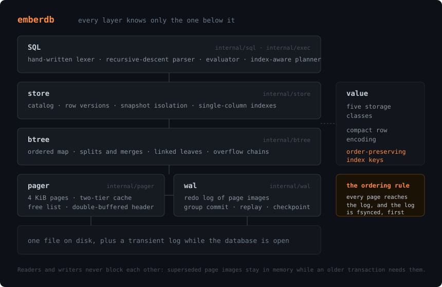
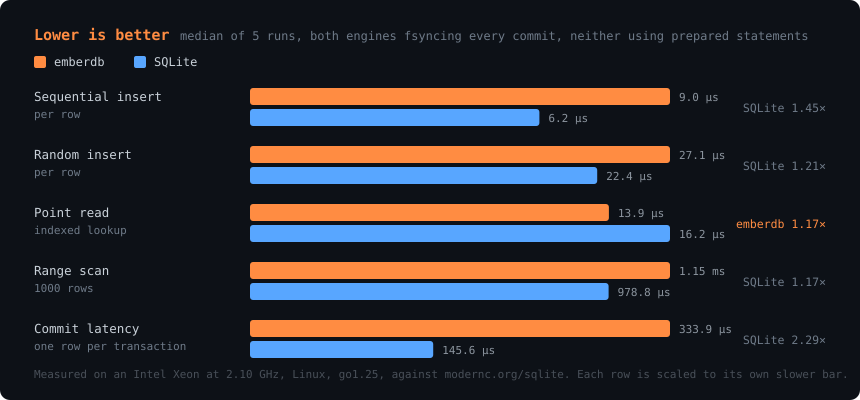

# emberdb

An embedded, single-file SQL database engine for Go — a page-based store with a
B+tree index, a write-ahead log with crash recovery, MVCC snapshot isolation,
and a hand-written SQL parser, usable as a library or through the `ember`
shell.

[](https://github.com/anshnt/emberdb/actions/workflows/ci.yml)
[](https://pkg.go.dev/github.com/anshnt/emberdb)
[](https://goreportcard.com/report/github.com/anshnt/emberdb)
[](LICENSE)


## Install

```sh
go get github.com/anshnt/emberdb                        # the library
go install github.com/anshnt/emberdb/cmd/ember@latest   # the shell
```

Nothing else. The core module has no third-party dependencies at all.

## Thirty seconds

```go
package main

import (
	"fmt"
	"log"

	"github.com/anshnt/emberdb"
)

func main() {
	db, err := emberdb.Open("notes.ember")
	if err != nil {
		log.Fatal(err)
	}
	defer db.Close()

	if _, err := db.Exec(`
		CREATE TABLE IF NOT EXISTS notes (
			id    INTEGER PRIMARY KEY,
			title TEXT NOT NULL,
			words INTEGER
		);
		INSERT INTO notes VALUES (1, 'pager design', 820), (2, 'btree splits', 1310);
		CREATE INDEX IF NOT EXISTS notes_by_words ON notes (words);
	`); err != nil {
		log.Fatal(err)
	}

	result, err := db.Query(`SELECT title, words FROM notes WHERE words > 900 ORDER BY words DESC`)
	if err != nil {
		log.Fatal(err)
	}
	for _, row := range result.Rows {
		fmt.Printf("%s (%s words)\n", row[0], row[1])
	}
	// btree splits (1310 words)
}
```

Or from a terminal:

```sh
ember notes.ember                                   # a REPL
ember notes.ember schema.sql seed.sql               # run files and exit
ember -c 'SELECT * FROM notes' notes.ember          # one statement
ember -mode csv -c 'SELECT * FROM notes' notes.ember > notes.csv
```

## What is in it

**Storage.** A single file of 4 KiB pages. The file header is double-buffered —
two checksummed copies two kilobytes apart, written alternately — so a crash
partway through a header write can only destroy the copy that was not live.
Freed pages go on a free list and are reused before the file grows.

**Durability.** A redo write-ahead log of full page images, CRC32-C framed.
Every page a transaction touched reaches the log, and the log is fsynced,
before a single byte of it is published. Replay applies only committed
transactions and stops at the first damaged record. Commits coalesce their
fsyncs. A clean close checkpoints and removes the log, so a database at rest
really is one file.

**Indexing.** A B+tree with node splitting, sibling borrowing and node merging,
doubly linked leaves so a range scan descends once and then walks sideways, and
overflow chains for values too large to share a page.

**Concurrency.** MVCC snapshot isolation. Rows are stored as versions stamped
with the transactions that created and deleted them, and the page cache keeps
superseded page images alive while an older transaction still needs them — so
readers and writers never block each other, and a scan sees a stable tree even
while a writer is splitting it. Dead versions are pruned when a row is next
written.

**SQL.** A hand-written lexer and recursive-descent parser, no generator.
`CREATE TABLE`, `CREATE INDEX`, `INSERT`, `SELECT` with `WHERE`, `ORDER BY`,
`LIMIT` and `OFFSET`, `UPDATE`, `DELETE`, and `BEGIN`/`COMMIT`/`ROLLBACK`.
Typed columns — `INTEGER`, `REAL`, `TEXT`, `BLOB` — with three-valued null
logic. Parse errors carry a line, a column and a caret under the problem.

**Shell.** A REPL with history and line editing, `.tables`, `.schema`,
`.timer`, `.mode`, `.read` and `.stats`, and table, CSV or list output.

## How it fits together



[ARCHITECTURE.md](ARCHITECTURE.md) walks through each layer.
[docs/format.md](docs/format.md) has byte-offset tables for everything on disk.
[docs/decisions.md](docs/decisions.md) explains the trade-offs, including the
design that had to be thrown away.

## Benchmarks



Measured, not estimated. Median of five runs on an Intel Xeon at 2.10 GHz,
Linux, go1.25, against `modernc.org/sqlite` 1.57. Run-to-run spread was 11–16%,
so treat differences under about 20% as noise. Reproduce with:

```sh
cd bench && go test -bench . -benchtime 3s -count 5
```

| Benchmark | emberdb | SQLite | |
| --- | ---: | ---: | --- |
| Sequential insert, per row | 9.0 µs | 6.2 µs | SQLite 1.45× faster |
| Random insert, per row | 27.1 µs | 22.4 µs | SQLite 1.21× faster |
| Point read, indexed | 13.9 µs | 16.2 µs | **emberdb 1.17× faster** |
| Range scan, 1000 rows | 1.15 ms | 0.98 ms | SQLite 1.17× faster |
| Commit latency, one row per transaction | 334 µs | 146 µs | SQLite 2.29× faster |

**SQLite is faster at four of the five**, and it should be — it has had two
decades of people making it faster. The places it wins are worth naming rather
than burying:

- **Commit latency, by 2.3×, is the widest gap.** emberdb logs whole 4 KiB page
  images, and a single-row insert also has to log the catalog page because the
  row-id counter lives there. SQLite writes less per commit for the same work.
- **Bulk inserts, by 1.2–1.45×.** Every modified page is logged in full, so
  emberdb writes more bytes per row than SQLite does.
- **Range scans, by 1.17×**, which is close enough to the noise floor to call
  it even.

emberdb wins **point reads by 1.17×**, which is a fair fight: neither side uses
prepared statements, so both parse each statement, and both then do an index
descent and a row fetch.

**These numbers are not SQLite at its best**, and saying so is part of reporting
them. emberdb has no prepared statements, so the benchmarks make SQLite parse
every statement too. With prepared statements and bound parameters SQLite pulls
further ahead on every line above. The comparison measures two engines doing
the same work, not the fastest thing SQLite can do.

`bench/bench_test.go` states the rest of the rules — one connection each, WAL
mode with `synchronous = FULL` on the SQLite side to match emberdb's
unconditional fsync, a thousand rows per transaction for the bulk loads, and a
fresh database file per benchmark.

## Not production ready

Say it plainly: **do not put data you care about in this.** It is a from-scratch
engine written to be understood, and it has none of the mileage that makes a
database trustworthy. SQLite has been deployed on billions of devices for two
decades; emberdb has a test suite and a few weeks.

Concretely, what it does not have:

- **Age.** The crash suite kills a process at two hundred points and checks
  every invariant it can. That is a strong test and it is not the same as years
  of production traffic finding the cases nobody thought to test.
- **Real power-loss testing.** SIGKILL destroys emberdb's own buffers, which is
  what recovery is for, but it does not simulate a disk that reorders or
  half-writes a sector. The log's own tests damage records deliberately to cover
  those, which is not the same as having survived them in the wild.
- **A vacuum.** Space from deleted rows comes back when the row is next written,
  and not otherwise.
- **Multi-process access.** One process at a time. There is no file locking, and
  two processes opening the same database will corrupt it.
- **A large SQL surface.** No joins, subqueries, aggregates, `DROP`, `ALTER`, or
  multi-column indexes. [docs/decisions.md](docs/decisions.md) says why for each.
- **Encryption, replication, or backup tooling.**

What it is good for: learning how a database works, small embedded workloads
where losing the data would be an inconvenience rather than a disaster, and
reading. The code is written to be read.

## Development

```sh
go test ./...                                              # the whole suite
go test -race ./...                                        # what CI runs
EMBER_CRASH_ITERS=200 go test -run TestCrashRecovery ./internal/crash/
cd bench && go test -bench . -benchtime 3s                 # against SQLite
```

[CONTRIBUTING.md](CONTRIBUTING.md) has the rest.

## License

MIT. See [LICENSE](LICENSE).
