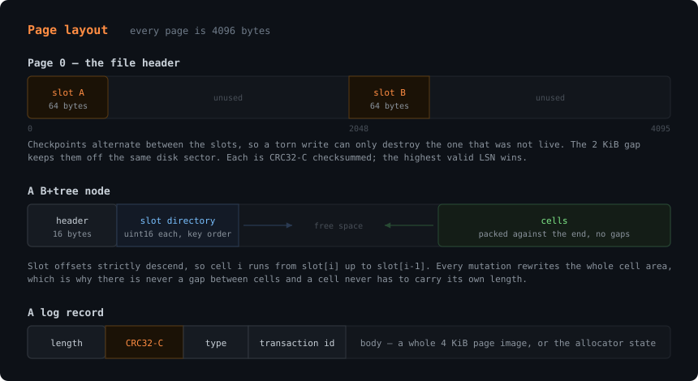

# The emberdb file format

Version 1. Everything below is little-endian unless a field says otherwise;
the exceptions are the row and index keys, which are big-endian so that byte
order matches numeric order.

A database is one file of 4 KiB pages. While it is open, a second file sits
beside it — the write-ahead log, named by appending `-wal` to the database
path. A clean shutdown checkpoints and removes it, so a database at rest is a
single file.

## Page 0: the file header

Page 0 holds two independent copies of the header, 64 bytes each, at offsets
0 and 2048. Writes alternate between them, so a crash partway through a header
write can only destroy the slot that was not live. The 2 KiB gap guarantees
the two slots never share a disk sector.

On open, both slots are read. Of those carrying the magic and passing their
checksum, the one with the highest LSN wins. If neither passes, the file
cannot be opened.

| Offset | Size | Field | Notes |
| ---: | ---: | --- | --- |
| 0 | 8 | magic | `45 4D 42 45 52 44 42 1A` — `EMBERDB\x1a` |
| 8 | 2 | format version | 1; any other value is refused |
| 10 | 2 | page size | 4096; a file with another page size is refused |
| 12 | 4 | page count | Total pages in the file, including page 0 |
| 16 | 4 | free-list head | First free page, or 0 when the list is empty |
| 20 | 4 | free-list count | Pages currently on the free list |
| 24 | 8 | LSN | Log sequence number of the last checkpoint |
| 32 | 24 | engine metadata | See below |
| 56 | 4 | reserved | Zero |
| 60 | 4 | checksum | CRC32-C of bytes 0–59 |

The 24 bytes of engine metadata are opaque to the pager:

| Offset | Size | Field |
| ---: | ---: | --- |
| 0 | 4 | Catalog root page |
| 4 | 8 | Next transaction id |
| 12 | 12 | Reserved |

Both live here rather than in a page of their own so that they become durable
in the same atomic header write as the allocator state they belong with.

## Free pages

A free page's first four bytes are the page id of the next free page, or 0 at
the end of the list. The rest is zeroed. The allocator drains the list before
extending the file, so deleted space is reused rather than leaked.

## B+tree nodes

Internal and leaf nodes share a 16-byte header, followed by a slot directory
of `uint16` offsets — one per cell, in key order — and then the cells
themselves, packed against the end of the page.

Slot offsets strictly descend: cell *i* runs from `slot[i]` up to `slot[i-1]`,
or to the end of the page for cell 0. Every mutation rewrites the whole cell
area, so there is never a hole between cells and a cell's length never has to
be stored.

| Offset | Size | Field | Notes |
| ---: | ---: | --- | --- |
| 0 | 1 | node kind | 1 internal, 2 leaf, 3 overflow |
| 1 | 1 | flags | Reserved, zero |
| 2 | 2 | cell count | Number of slots that follow the header |
| 4 | 4 | reserved | Zero |
| 8 | 4 | next / rightmost | Leaf: the following leaf. Internal: the rightmost child |
| 12 | 4 | previous | Leaf: the preceding leaf. Internal: reserved |
| 16 | 2×count | slot directory | Byte offsets of the cells, in key order |
| … | | cells | Packed against the end of the page |

An internal node with *n* separators has *n+1* children: the *n* named by its
cells, plus the rightmost. Separator *i* divides child *i* from child *i+1*,
and is exclusive on the left — a key equal to a separator belongs to the child
on its right.

### Leaf cell

| Size | Field | Notes |
| ---: | --- | --- |
| 1 | flags | Bit 0 set means the value lives in an overflow chain |
| varint | key length | Unsigned |
| n | key | At most 512 bytes |
| varint | value length | The value's full length, even when it overflows |
| n or 4 | value | The bytes, or the first page of the overflow chain |

A cell larger than a quarter page moves its value to an overflow chain, which
keeps at least four entries on every leaf however large the values are.

### Internal cell

| Size | Field | Notes |
| ---: | --- | --- |
| 4 | child page | Holds the keys below this separator |
| varint | key length | Unsigned |
| n | separator key | At most 512 bytes |

### Overflow page

| Offset | Size | Field |
| ---: | ---: | --- |
| 0 | 1 | Node kind, always 3 |
| 1 | 3 | Reserved |
| 4 | 4 | Next page in the chain, or 0 |
| 8 | 4 | Payload bytes in this page |
| 12 | 4084 | Payload |

## Rows

Every table is a B+tree. Its keys identify a *version* of a row, not a row:

| Offset | Size | Field |
| ---: | ---: | --- |
| 0 | 8 | Row id, big-endian |
| 8 | 8 | Creating transaction id (xmin), big-endian |

Big-endian so that byte order is numeric order, which keeps rows in row-id
order and gathers every version of a row together, oldest first.

The value is:

| Offset | Size | Field |
| ---: | ---: | --- |
| 0 | 8 | Deleting transaction id (xmax), or 0 while the version is live |
| 8 | … | The row's values |

Each value is a one-byte type tag followed by its payload:

| Tag | Type | Payload |
| ---: | --- | --- |
| 0 | NULL | Nothing |
| 1 | INTEGER | Signed varint |
| 2 | REAL | 8 bytes, IEEE 754 |
| 3 | TEXT | Unsigned varint length, then UTF-8 bytes |
| 4 | BLOB | Unsigned varint length, then the bytes |

## Index keys

An index is a B+tree whose keys carry everything and whose values are empty:

| Size | Field |
| ---: | --- |
| n | The column value, encoded so byte order matches value order |
| 8 | Row id, big-endian |
| 8 | Creating transaction id, big-endian |

Indexing versions rather than rows is what makes an index scan return each row
exactly once under snapshot isolation: at most one version of a row is visible
to a given snapshot, so at most one of its entries survives the check.

The order-preserving value encoding is a tag byte and then:

| Tag | Type | Encoding |
| ---: | --- | --- |
| 0x00 | NULL | Nothing; null sorts first |
| 0x01 | INTEGER | Sign bit flipped, big-endian, which maps the signed range onto the unsigned range in order |
| 0x02 | REAL | A negative float inverted entirely, a positive one with its sign bit set, big-endian |
| 0x03 | TEXT | Zero bytes escaped as `00 FF`, terminated by `00 00` |
| 0x04 | BLOB | As TEXT |

The escaping is what lets a row id be appended after a variable-length value
without disturbing the order. Without it, `"a"` followed by a row id of
`FF FF …` would sort after `"ab"` followed by anything, and the index would be
quietly, subtly wrong.

## The write-ahead log

The log is a separate file, `<database>-wal`, and is transient: it exists only
between a checkpoint and the crash or clean shutdown that follows.

Its header is written once and rewritten whenever a checkpoint restarts the
log:

| Offset | Size | Field | Notes |
| ---: | ---: | --- | --- |
| 0 | 8 | magic | `EMBERWAL` |
| 8 | 2 | format version | 1 |
| 10 | 2 | page size | 4096 |
| 12 | 8 | base LSN | The sequence number the first record follows |
| 20 | 8 | reserved | Zero |
| 28 | 4 | checksum | CRC32-C of bytes 0–27 |

Records follow, each framed by a length and a checksum:

| Offset | Size | Field |
| ---: | ---: | --- |
| 0 | 4 | Payload length |
| 4 | 4 | CRC32-C of the payload |
| 8 | n | Payload |

The payload starts with the record type and the transaction it belongs to:

| Offset | Size | Field |
| ---: | ---: | --- |
| 0 | 1 | Record type: 1 begin, 2 page, 3 commit, 4 abort |
| 1 | 8 | Transaction id |
| 9 | … | Body |

A **page** record's body is a 4-byte page id and then the whole 4096-byte
page. A **commit** record's body is the allocator state the transaction
installed — page count, free-list head, free-list count, and the 24 bytes of
engine metadata — so recovery can restore the header without reading it.
**Begin** and **abort** records have no body.

Replay reads from the start, buffering page records and applying them only
when the matching commit record arrives. It stops at the first record that is
short, implausibly long, or fails its checksum, and truncates from there. That
is not a heuristic: everything after a damaged record belongs to transactions
that never returned from commit.
